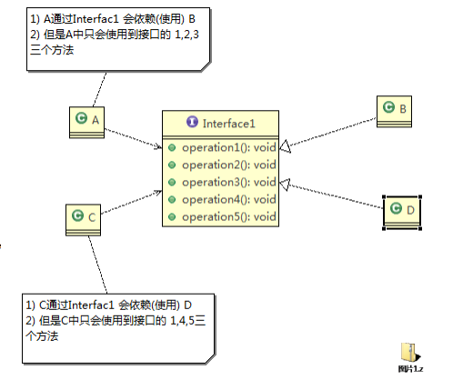

设计模式原则，其实就是程序员在编程时，应当遵守的原则，也是各种设计模
式的基础(即：设计模式为什么这样设计的依据)

设计模式常用的七大原则有:
1) 单一职责原则
2) 接口隔离原则
3) 依赖倒转(倒置)原则
4) 里氏替换原则
5) 开闭原则
6) 迪米特法则
7) 合成复用原则

## 单一职责原则
对类来说的，即一个类应该只负责一项职责。如类A负责两个不同职责：职责1，职责2。
当职责1需求变更而改变A时，可能造成职责2执行错误，所以需要将类A的粒度分解为
A1，A2

### 单一职责原则注意事项和细节

1) 降低类的复杂度，一个类只负责一项职责。
2) 提高类的可读性，可维护性
3) 降低变更引起的风险
4) 通常情况下，我们应当遵守单一职责原则，只有逻辑足够简单，才可以在代码级违
反单一职责原则；只有类中方法数量足够少，可以在方法级别保持单一职责原则

### 代码示例

```` java

````

## 接口隔离原则(Interface Segregation Principle)




1) 客户端不应该依赖它不需要的接口，即一个类对另一个类的依赖应该建立在最小的接口上

2) 类A通过接口Interface1依赖类B，类C通过接口Interface1依赖类D，如果接口Interface1对于类A和类C来说不是最小接口，那么类B和类D必须去实现他们不需要的方法。

3) 按隔离原则应当这样处理：将接口Interface1拆分为独立的几个接口，类A和类C分别与他们需要的接口建立依赖关系。也就是采用接口隔离原则

## 依赖倒转原则

1) 高层模块不应该依赖低层模块，二者都应该依赖其抽象
2) 抽象不应该依赖细节，细节应该依赖抽象
3) 依赖倒转(倒置)的中心思想是面向接口编程
4) 依赖倒转原则是基于这样的设计理念：相对于细节的多变性，抽象的东西要稳定的多。以抽象为基础搭建的架
构比以细节为基础的架构要稳定的多。在 java 中，抽象指的是接口或抽象类，细节就是具体的实现类
5) 使用接口或抽象类的目的是制定好规范，而不涉及任何具体的操作，把展现细节的任务交给他们的实现类去完
成

## 里氏替换原则

OO中的继承性的思考和说明
1) 继承包含这样一层含义：父类中凡是已经实现好的方法，实际上是在设定规范和契
约，虽然它不强制要求所有的子类必须遵循这些契约，但是如果子类对这些已经实
现的方法任意修改，就会对整个继承体系造成破坏。
2) 继承在给程序设计带来便利的同时，也带来了弊端。比如使用继承会给程序带来侵
入性，程序的可移植性降低，增加对象间的耦合性，如果一个类被其他的类所继承，
则当这个类需要修改时，必须考虑到所有的子类，并且父类修改后，所有涉及到子
类的功能都有可能产生故障
3) 问题提出：在编程中，如何正确的使用继承? => 里氏替换原则

基本介绍
1) 里氏替换原则(Liskov Substitution Principle)在1988年，由麻省理工学院的以为姓里
的女士提出的。
2) 如果对每个类型为T1的对象o1，都有类型为T2的对象o2，使得以T1定义的所有程序
P在所有的对象o1都代换成o2时，程序P的行为没有发生变化，那么类型T2是类型T1
的子类型。换句话说，所有引用基类的地方必须能透明地使用其子类的对象。
3) 在使用继承时，遵循里氏替换原则，在子类中尽量不要重写父类的方法
4) 里氏替换原则告诉我们，继承实际上让两个类耦合性增强了，在适当的情况下，可以通过聚合，组合，依赖 来解决问题。.

一个程序引出的问题和思考


解决方法
1) 我们发现原来运行正常的相减功能发生了错误。原因就是类B无意中重写了父类的
方法，造成原有功能出现错误。在实际编程中，我们常常会通过重写父类的方法完
成新的功能，这样写起来虽然简单，但整个继承体系的复用性会比较差。特别是运
行多态比较频繁的时候
2) 通用的做法是：原来的父类和子类都继承一个更通俗的基类，原有的继承关系去掉，
采用依赖，聚合，组合等关系代替.

## 开闭原则

1) 开闭原则（Open Closed Principle）是编程中最基础、最重要的设计原则
2) 一个软件实体如类，模块和函数应该对扩展开放(对提供方)，对修改关闭(对使用
方)。用抽象构建框架，用实现扩展细节。
3) 当软件需要变化时，尽量通过扩展软件实体的行为来实现变化，而不是通过修改已
有的代码来实现变化。
4) 编程中遵循其它原则，以及使用设计模式的目的就是遵循开闭原则。


```` java
package com.atguigu.principle.ocp;

public class Ocp {

	public static void main(String[] args) {
		//使用看看存在的问题
		GraphicEditor graphicEditor = new GraphicEditor();
		graphicEditor.drawShape(new Rectangle());
		graphicEditor.drawShape(new Circle());
		graphicEditor.drawShape(new Triangle());
	}

}

//这是一个用于绘图的类 [使用方]
class GraphicEditor {
	//接收Shape对象，然后根据type，来绘制不同的图形
	public void drawShape(Shape s) {
		if (s.m_type == 1)
			drawRectangle(s);
		else if (s.m_type == 2)
			drawCircle(s);
		else if (s.m_type == 3)
			drawTriangle(s);
	}

	//绘制矩形
	public void drawRectangle(Shape r) {
		System.out.println(" 绘制矩形 ");
	}

	//绘制圆形
	public void drawCircle(Shape r) {
		System.out.println(" 绘制圆形 ");
	}
	
	//绘制三角形
	public void drawTriangle(Shape r) {
		System.out.println(" 绘制三角形 ");
	}
}

//Shape类，基类
class Shape {
	int m_type;
}

class Rectangle extends Shape {
	Rectangle() {
		super.m_type = 1;
	}
}

class Circle extends Shape {
	Circle() {
		super.m_type = 2;
	}
}

//新增画三角形
class Triangle extends Shape {
	Triangle() {
		super.m_type = 3;
	}
}

````

1) 优点是比较好理解，简单易操作。
2) 缺点是违反了设计模式的ocp原则，即对扩展开放(提供方)，对修改关闭(使用方)。
即当我们给类增加新功能的时候，尽量不修改代码，或者尽可能少修改代码.
3) 比如我们这时要新增加一个图形种类 三角形，我们需要做如下修改，修改的地方
较多
4) 代码演示

方式1的改进的思路分析

改进的思路分析
思路：把创建Shape类做成抽象类，并提供一个抽象的draw方法，让子类去实现即可，
这样我们有新的图形种类时，只需要让新的图形类继承Shape，并实现draw方法即可，
使用方的代码就不需要修 -> 满足了开闭原则

````java
package com.atguigu.principle.ocp.improve;

public class Ocp {

	public static void main(String[] args) {
		//使用看看存在的问题
		GraphicEditor graphicEditor = new GraphicEditor();
		graphicEditor.drawShape(new Rectangle());
		graphicEditor.drawShape(new Circle());
		graphicEditor.drawShape(new Triangle());
		graphicEditor.drawShape(new OtherGraphic());
	}

}

//这是一个用于绘图的类 [使用方]
class GraphicEditor {
	//接收Shape对象，调用draw方法
	public void drawShape(Shape s) {
		s.draw();
	}

	
}

//Shape类，基类
abstract class Shape {
	int m_type;
	
	public abstract void draw();//抽象方法
}

class Rectangle extends Shape {
	Rectangle() {
		super.m_type = 1;
	}

	@Override
	public void draw() {
		// TODO Auto-generated method stub
		System.out.println(" 绘制矩形 ");
	}
}

class Circle extends Shape {
	Circle() {
		super.m_type = 2;
	}
	@Override
	public void draw() {
		// TODO Auto-generated method stub
		System.out.println(" 绘制圆形 ");
	}
}

//新增画三角形
class Triangle extends Shape {
	Triangle() {
		super.m_type = 3;
	}
	@Override
	public void draw() {
		// TODO Auto-generated method stub
		System.out.println(" 绘制三角形 ");
	}
}

//新增一个图形
class OtherGraphic extends Shape {
	OtherGraphic() {
		super.m_type = 4;
	}

	@Override
	public void draw() {
		// TODO Auto-generated method stub
		System.out.println(" 绘制其它图形 ");
	}
}

````

## 迪米特法则
1) 一个对象应该对其他对象保持最少的了解
2) 类与类关系越密切，耦合度越大
3) 迪米特法则(Demeter Principle)又叫最少知道原则，即一个类对自己依赖的类知道的
越少越好。也就是说，对于被依赖的类不管多么复杂，都尽量将逻辑封装在类的内
部。对外除了提供的public 方法，不对外泄露任何信息
4) 迪米特法则还有个更简单的定义：只与直接的朋友通信
5) 直接的朋友：每个对象都会与其他对象有耦合关系，只要两个对象之间有耦合关系，
我们就说这两个对象之间是朋友关系。耦合的方式很多，依赖，关联，组合，聚合
等。其中，我们称出现成员变量，方法参数，方法返回值中的类为直接的朋友，而
出现在局部变量中的类不是直接的朋友。也就是说，陌生的类最好不要以局部变量
的形式出现在类的内部。

## 合成复用原则
原则是尽量使用合成/聚合的方式，而不是使用继承


## 设计原则核心思想
1) 找出应用中可能需要变化之处，把它们独立出来，不要和那些不需要变化的代
码混在一起。
2) 针对接口编程，而不是针对实现编程。
3) 为了交互对象之间的松耦合设计而努力
