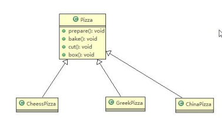
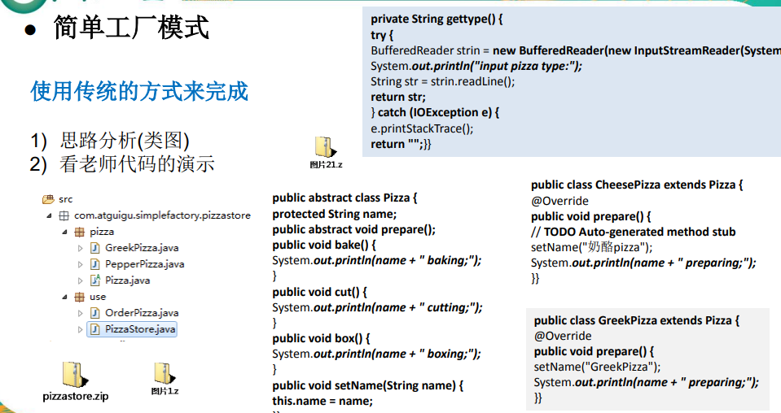
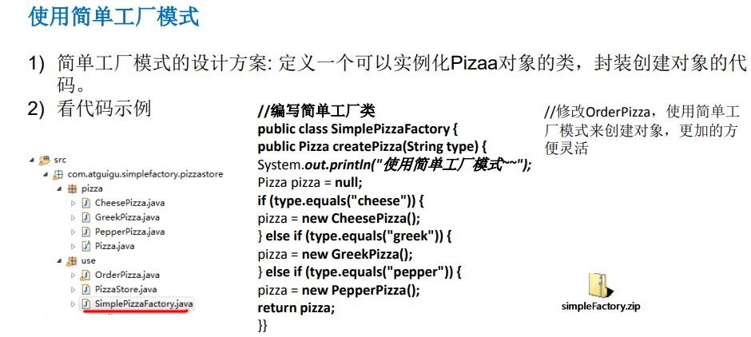

## 简单工厂模式

### 看一个具体的需求

看一个披萨的项目：要便于披萨种类的扩展，要便于维护
1) 披萨的种类很多(比如 GreekPizz、CheesePizz 等)
2) 披萨的制作有 prepare，bake, cut, box
3) 完成披萨店订购功能。

1) 优点是比较好理解，简单易操作。
2) 缺点是违反了设计模式的ocp原则，即对扩展开放，对修改关闭。即当我们给类增
加新功能的时候，尽量不修改代码，或者尽可能少修改代码.
3) 比如我们这时要新增加一个Pizza的种类(Pepper披萨)，我们需要做如下修改.

### 使用简单工厂模式

1) 简单工厂模式是属于创建型模式，是工厂模式的一种。简单工厂模式是由一
个工厂对象决定创建出哪一种产品类的实例。简单工厂模式是工厂模式家族
中最简单实用的模式
2) 简单工厂模式：定义了一个创建对象的类，由这个类来封装实例化对象的行
为(代码)
3) 在软件开发中，当我们会用到大量的创建某种、某类或者某批对象时，就会
使用到工厂模式.

## 工厂方法模式

工厂方法模式设计方案：将披萨项目的实例化功能抽象成抽象方法，在不同的口味点
餐子类中具体实现。

工厂方法模式：定义了一个创建对象的抽象方法，由子类决定要实例化的类。工厂方
法模式将对象的实例化推迟到子类

## 抽象工厂模式

1) 抽象工厂模式：定义了一个interface用于创建相关或有依赖关系的对象簇，而无需
指明具体的类
2) 抽象工厂模式可以将简单工厂模式和工厂方法模式进行整合。
3) 从设计层面看，抽象工厂模式就是对简单工厂模式的改进(或者称为进一步的抽象)。
4) 将工厂抽象成两层，AbsFactory(抽象工厂) 和 具体实现的工厂子类。程序员可以
根据创建对象类型使用对应的工厂子类。这样将单个的简单工厂类变成了工厂簇，
更利于代码的维护和扩展。
5) 类图

## 工厂模式模式