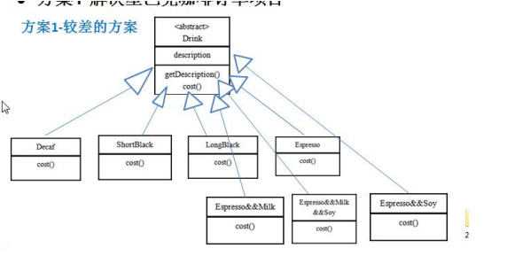
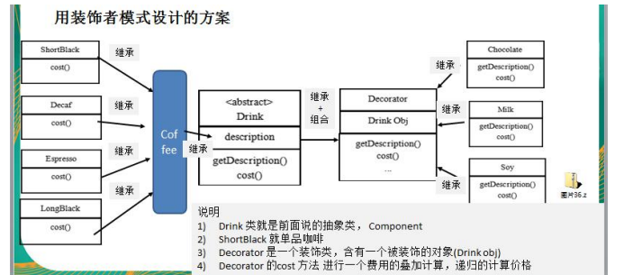

## 星巴克咖啡订单项目（咖啡馆）：
1) 咖啡种类/单品咖啡：Espresso(意大利浓咖啡)、ShortBlack、LongBlack(美式咖啡)、Decaf(无因咖啡)
2) 调料：Milk、Soy(豆浆)、Chocolate
3) 要求在扩展新的咖啡种类时，具有良好的扩展性、改动方便、维护方便
4) 使用 OO 的来计算不同种类咖啡的费用: 客户可以点单品咖啡，也可以单品咖啡+调料组合。



### 方案 1-解决星巴克咖啡订单问题分析

1) Drink 是一个抽象类，表示饮料
2) des 就是对咖啡的描述, 比如咖啡的名字
3) cost() 方法就是计算费用，Drink 类中做成一个抽象方法. 4) Decaf 就是单品咖啡， 继承 Drink, 并实现 cost
5) Espress && Milk 就是单品咖啡+调料， 这个组合很多
6) 问题：这样设计，会有很多类，当我们增加一个单品咖啡，或者一个新的调料，类的数量就会倍增，就会出现
类爆炸

### 方案 2-解决星巴克咖啡订单(好点)
1) 前面分析到方案 1 因为咖啡单品+调料组合会造成类的倍增，因此可以做改进，将调料内置到 Drink 类，这
样就不会造成类数量过多。从而提高项目的维护性(如图)


#### 方案 2-解决星巴克咖啡订单问题分析

1) 方案 2 可以控制类的数量，不至于造成很多的类
2) 在增加或者删除调料种类时，代码的维护量很大
3) 考虑到用户可以添加多份 调料时，可以将 hasMilk 返回一个对应 int
4) 考虑使用 装饰者 模式

## 装饰者模式定义
1) 装饰者模式：动态的将新功能附加到对象上。在对象功能扩展方面，它比继承更有弹性，装饰者模式也体现了
开闭原则(ocp)
2) 这里提到的动态的将新功能附加到对象和 ocp 原则，在后面的应用实例上会以代码的形式体现，请同学们注意
体会

### 装饰者模式原理
1) 装饰者模式就像打包一个快递
主体：比如：陶瓷、衣服 (Component) // 被装饰者
包装：比如：报纸填充、塑料泡沫、纸板、木板(Decorator)
2) Component 主体：比如类似前面的 Drink
3) ConcreteComponent 和 Decorator
ConcreteComponent：具体的主体，
比如前面的各个单品咖啡
4) Decorator: 装饰者，比如各调料. 在如图的 Component 与 ConcreteComponent 之间，如果 ConcreteComponent 类很多,还可以设计一个缓冲层，将
共有的部分提取出来，抽象层一个类。


### 装饰者模式解决星巴克咖啡订单



````java
package com.atguigu.decorator;

//具体的Decorator， 这里就是调味品
public class Chocolate extends Decorator {

	public Chocolate(Drink obj) {
		super(obj);
		setDes(" 巧克力 ");
		setPrice(3.0f); // 调味品 的价格
	}

}

````
````java
package com.atguigu.decorator;

public class Coffee  extends Drink {

	@Override
	public float cost() {
		// TODO Auto-generated method stub
		return super.getPrice();
	}

	
}

````
````java
package com.atguigu.decorator;

public class CoffeeBar {

	public static void main(String[] args) {
		// TODO Auto-generated method stub
		// 装饰者模式下的订单：2份巧克力+一份牛奶的LongBlack

		// 1. 点一份 LongBlack
		Drink order = new LongBlack();
		System.out.println("费用1=" + order.cost());
		System.out.println("描述=" + order.getDes());

		// 2. order 加入一份牛奶
		order = new Milk(order);

		System.out.println("order 加入一份牛奶 费用 =" + order.cost());
		System.out.println("order 加入一份牛奶 描述 = " + order.getDes());

		// 3. order 加入一份巧克力

		order = new Chocolate(order);

		System.out.println("order 加入一份牛奶 加入一份巧克力  费用 =" + order.cost());
		System.out.println("order 加入一份牛奶 加入一份巧克力 描述 = " + order.getDes());

		// 3. order 加入一份巧克力

		order = new Chocolate(order);

		System.out.println("order 加入一份牛奶 加入2份巧克力   费用 =" + order.cost());
		System.out.println("order 加入一份牛奶 加入2份巧克力 描述 = " + order.getDes());
	
		System.out.println("===========================");
		
		Drink order2 = new DeCaf();
		
		System.out.println("order2 无因咖啡  费用 =" + order2.cost());
		System.out.println("order2 无因咖啡 描述 = " + order2.getDes());
		
		order2 = new Milk(order2);
		
		System.out.println("order2 无因咖啡 加入一份牛奶  费用 =" + order2.cost());
		System.out.println("order2 无因咖啡 加入一份牛奶 描述 = " + order2.getDes());

	
	}

}

````
````java
package com.atguigu.decorator;

public class DeCaf extends Coffee {

	public DeCaf() {
		setDes(" 无因咖啡 ");
		setPrice(1.0f);
	}
}

````
````java
package com.atguigu.decorator;

public class Decorator extends Drink {
	private Drink obj;
	
	public Decorator(Drink obj) { //组合
		// TODO Auto-generated constructor stub
		this.obj = obj;
	}
	
	@Override
	public float cost() {
		// TODO Auto-generated method stub
		// getPrice 自己价格
		return super.getPrice() + obj.cost();
	}
	
	@Override
	public String getDes() {
		// TODO Auto-generated method stub
		// obj.getDes() 输出被装饰者的信息
		return des + " " + getPrice() + " && " + obj.getDes();
	}
	
	

}

````
````java
package com.atguigu.decorator;

public abstract class Drink {

	public String des; // 描述
	private float price = 0.0f;
	public String getDes() {
		return des;
	}
	public void setDes(String des) {
		this.des = des;
	}
	public float getPrice() {
		return price;
	}
	public void setPrice(float price) {
		this.price = price;
	}
	
	//计算费用的抽象方法
	//子类来实现
	public abstract float cost();
	
}

````
````java
package com.atguigu.decorator;

public class Espresso extends Coffee {
	
	public Espresso() {
		setDes(" 意大利咖啡 ");
		setPrice(6.0f);
	}
}

````
````java
package com.atguigu.decorator;

public class LongBlack extends Coffee {

	public LongBlack() {
		setDes(" longblack ");
		setPrice(5.0f);
	}
}

````
````java
package com.atguigu.decorator;

public class Milk extends Decorator {

	public Milk(Drink obj) {
		super(obj);
		// TODO Auto-generated constructor stub
		setDes(" Å£ÄÌ ");
		setPrice(2.0f); 
	}

}

````
````java
package com.atguigu.decorator;

public class ShortBlack extends Coffee{
	
	public ShortBlack() {
		setDes(" shortblack ");
		setPrice(4.0f);
	}
}

````
````java
package com.atguigu.decorator;

public class Soy extends Decorator{

	public Soy(Drink obj) {
		super(obj);
		// TODO Auto-generated constructor stub
		setDes(" ¶¹½¬  ");
		setPrice(1.5f);
	}

}

````