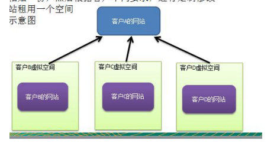
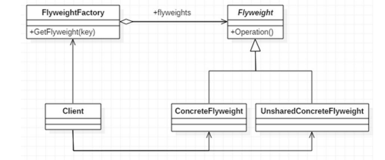

## 展示网站项目需求 
小型的外包项目，给客户 A 做一个产品展示网站，客户 A 的朋友感觉效果不错，也希望做这样的产品展示网
站，但是要求都有些不同：
1) 有客户要求以新闻的形式发布
2) 有客户人要求以博客的形式发布
3) 有客户希望以微信公众号的形式发布

### 传统方案解决网站展现项目

1) 直接复制粘贴一份，然后根据客户不同要求，进行定制修改
2) 给每个网站租用一个空间
3) 方案设计示意图




### 传统方案解决网站展现项目-问题分析
1) 需要的网站结构相似度很高，而且都不是高访问量网站，如果分成多个虚拟空间来处理，相当于一个相同网站
的实例对象很多，造成服务器的资源浪费
2) 解决思路：整合到一个网站中，共享其相关的代码和数据，对于硬盘、内存、CPU、数据库空间等服务器资源
都可以达成共享，减少服务器资源
3) 对于代码来说，由于是一份实例，维护和扩展都更加容易
4) 上面的解决思路就可以使用 享元模式 来解决

## 享元模式基本介绍
1) 享元模式（Flyweight Pattern） 也叫 蝇量模式: 运用共享技术有效地支持大量细粒度的对象
2) 常用于系统底层开发，解决系统的性能问题。像数据库连接池，里面都是创建好的连接对象，在这些连接对象
中有我们需要的则直接拿来用，避免重新创建，如果没有我们需要的，则创建一个
3) 享元模式能够解决重复对象的内存浪费的问题，当系统中有大量相似对象，需要缓冲池时。不需总是创建新对
象，可以从缓冲池里拿。这样可以降低系统内存，同时提高效率
4) 享元模式经典的应用场景就是池技术了，String 常量池、数据库连接池、缓冲池等等都是享元模式的应用，享
元模式是池技术的重要实现方式

## 享元模式的原理类图


1) FlyWeight 是抽象的享元角色, 他是产品的抽象类, 同时定义出对象的外部状态和内部状态(后面介绍) 的接口
或实现
2) ConcreteFlyWeight 是具体的享元角色，是具体的产品类，实现抽象角色定义相关业务
3) UnSharedConcreteFlyWeight 是不可共享的角色，一般不会出现在享元工厂。
4) FlyWeightFactory 享元工厂类，用于构建一个池容器(集合)， 同时提供从池中获取对象方法

## 内部状态和外部状态
比如围棋、五子棋、跳棋，它们都有大量的棋子对象，围棋和五子棋只有黑白两色，跳棋颜色多一点，所以棋子颜
色就是棋子的内部状态；而各个棋子之间的差别就是位置的不同，当我们落子后，落子颜色是定的，但位置是变化
的，所以棋子坐标就是棋子的外部状态
1) 享元模式提出了两个要求：细粒度和共享对象。这里就涉及到内部状态和外部状态了，即将对象的信息分为两
个部分：内部状态和外部状态
2) 内部状态指对象共享出来的信息，存储在享元对象内部且不会随环境的改变而改变
3) 外部状态指对象得以依赖的一个标记，是随环境改变而改变的、不可共享的状态。
4) 举个例子：围棋理论上有 361 个空位可以放棋子，每盘棋都有可能有两三百个棋子对象产生，因为内存空间有
限，一台服务器很难支持更多的玩家玩围棋游戏，如果用享元模式来处理棋子，那么棋子对象就可以减少到只
有两个实例，这样就很好的解决了对象的开销问题

### 代码实现
````java
package com.atguigu.flyweight;

public class Client {

	public static void main(String[] args) {
		// TODO Auto-generated method stub

		// 创建一个工厂类
		WebSiteFactory factory = new WebSiteFactory();

		// 客户要一个以新闻形式发布的网站
		WebSite webSite1 = factory.getWebSiteCategory("新闻");

		
		webSite1.use(new User("tom"));

		// 客户要一个以博客形式发布的网站
		WebSite webSite2 = factory.getWebSiteCategory("博客");

		webSite2.use(new User("jack"));

		// 客户要一个以博客形式发布的网站
		WebSite webSite3 = factory.getWebSiteCategory("博客");

		webSite3.use(new User("smith"));

		// 客户要一个以博客形式发布的网站
		WebSite webSite4 = factory.getWebSiteCategory("博客");

		webSite4.use(new User("king"));
		
		System.out.println("网站的分类共=" + factory.getWebSiteCount());
	}

}
````
````java
package com.atguigu.flyweight;

//具体网站
public class ConcreteWebSite extends WebSite {

	//共享的部分，内部状态
	private String type = ""; //网站发布的形式(类型)

	
	//构造器
	public ConcreteWebSite(String type) {
		
		this.type = type;
	}


	@Override
	public void use(User user) {
		// TODO Auto-generated method stub
		System.out.println("网站的发布形式为:" + type + " 在使用中 .. 使用者是" + user.getName());
	}
	
	
}

````
````java
package com.atguigu.flyweight;

public class User {
	
	private String name;

	
	public User(String name) {
		super();
		this.name = name;
	}

	public String getName() {
		return name;
	}

	public void setName(String name) {
		this.name = name;
	}
	
	
}

````
````java
package com.atguigu.flyweight;

public abstract class WebSite {

	public abstract void use(User user);//抽象方法
}

````
````java
package com.atguigu.flyweight;

import java.util.HashMap;

// 网站工厂类，根据需要返回压一个网站
public class WebSiteFactory {

	
	//集合， 充当池的作用
	private HashMap<String, ConcreteWebSite> pool = new HashMap<>();
	
	//根据网站的类型，返回一个网站, 如果没有就创建一个网站，并放入到池中,并返回
	public WebSite getWebSiteCategory(String type) {
		if(!pool.containsKey(type)) {
			//就创建一个网站，并放入到池中
			pool.put(type, new ConcreteWebSite(type));
		}
		
		return (WebSite)pool.get(type);
	}
	
	//获取网站分类的总数 (池中有多少个网站类型)
	public int getWebSiteCount() {
		return pool.size();
	}
}

````

## 享元模式的注意事项和细节
1) 在享元模式这样理解，“享”就表示共享，“元”表示对象
2) 系统中有大量对象，这些对象消耗大量内存，并且对象的状态大部分可以外部化时，我们就可以考虑选用享元
模式
3) 用唯一标识码判断，如果在内存中有，则返回这个唯一标识码所标识的对象，用 HashMap/HashTable 存储
4) 享元模式大大减少了对象的创建，降低了程序内存的占用，提高效率
5) 享元模式提高了系统的复杂度。需要分离出内部状态和外部状态，而外部状态具有固化特性，不应该随着内部
状态的改变而改变，这是我们使用享元模式需要注意的地方. 
6) 使用享元模式时，注意划分内部状态和外部状态，并且需要有一个工厂类加以控制。
7) 享元模式经典的应用场景是需要缓冲池的场景，比如 String 常量池、数据库连接池