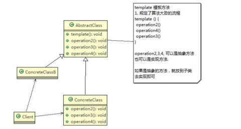

## 豆浆制作问题
1) 制作豆浆的流程 选材--->添加配料--->浸泡--->放到豆浆机打碎
2) 通过添加不同的配料，可以制作出不同口味的豆浆
3) 选材、浸泡和放到豆浆机打碎这几个步骤对于制作每种口味的豆浆都是一样的
4) 请使用 模板方法模式 完成 (说明：因为模板方法模式，比较简单，很容易就想到这个方案，因此就直接使用，
不再使用传统的方案来引出模板方法模式 )

### 模板方法模式基本介绍
1) 模板方法模式（Template Method Pattern），又叫模板模式(Template Pattern)，z 在一个抽象类公开定义了执行
它的方法的模板。它的子类可以按需要重写方法实现，但调用将以抽象类中定义的方式进行。
2) 简单说，模板方法模式 定义一个操作中的算法的骨架，而将一些步骤延迟到子类中，使得子类可以不改变一
个算法的结构，就可以重定义该算法的某些特定步骤
3) 这种类型的设计模式属于行为型模式。



1) AbstractClass 抽象类， 类中实现了模板方法(template)，定义了算法的骨架，具体子类需要去实现 其它的抽象
方法 operationr2,3,4
2) ConcreteClass 实现抽象方法 operationr2,3,4, 以完成算法中特点子类的步骤

### 模板方法模式解决豆浆制作问题


````java
package com.atguigu.template;

public class Client {

	public static void main(String[] args) {
		// TODO Auto-generated method stub
		//制作红豆豆浆
		
		System.out.println("----制作红豆豆浆----");
		SoyaMilk redBeanSoyaMilk = new RedBeanSoyaMilk();
		redBeanSoyaMilk.make();
		
		System.out.println("----制作花生豆浆----");
		SoyaMilk peanutSoyaMilk = new PeanutSoyaMilk();
		peanutSoyaMilk.make();
	}

}

````
````java
package com.atguigu.template;

public class PeanutSoyaMilk extends SoyaMilk {

	@Override
	void addCondiments() {
		// TODO Auto-generated method stub
		System.out.println(" 加入上好的花生 ");
	}

}

````
````java
package com.atguigu.template;

public class RedBeanSoyaMilk extends SoyaMilk {

	@Override
	void addCondiments() {
		// TODO Auto-generated method stub
		System.out.println(" 加入上好的红豆 ");
	}

}

````
````java
package com.atguigu.template;

//抽象类，表示豆浆
public abstract class SoyaMilk {

	//模板方法, make , 模板方法可以做成final , 不让子类去覆盖.
	final void make() {
		
		select(); 
		addCondiments();
		soak();
		beat();
		
	}
	
	//选材料
	void select() {
		System.out.println("第一步：选择好的新鲜黄豆  ");
	}
	
	//添加不同的配料， 抽象方法, 子类具体实现
	abstract void addCondiments();
	
	//浸泡
	void soak() {
		System.out.println("第三步， 黄豆和配料开始浸泡， 需要3小时 ");
	}
	 
	void beat() {
		System.out.println("第四步：黄豆和配料放到豆浆机去打碎  ");
	}
}

````

## 模板方法模式的钩子方法
1) 在模板方法模式的父类中，我们可以定义一个方法，它默认不做任何事，子类可以视情况要不要覆盖它，该方
法称为“钩子”。
2) 还是用上面做豆浆的例子来讲解，比如，我们还希望制作纯豆浆，不添加任何的配料，请使用钩子方法对前面
的模板方法进行改造

````java
package com.atguigu.template.improve;

public class Client {

	public static void main(String[] args) {
		// TODO Auto-generated method stub
		//制作红豆豆浆
		
		System.out.println("----制作红豆豆浆----");
		SoyaMilk redBeanSoyaMilk = new RedBeanSoyaMilk();
		redBeanSoyaMilk.make();
		
		System.out.println("----制作花生豆浆----");
		SoyaMilk peanutSoyaMilk = new PeanutSoyaMilk();
		peanutSoyaMilk.make();
		
		System.out.println("----制作纯豆浆----");
		SoyaMilk pureSoyaMilk = new PureSoyaMilk();
		pureSoyaMilk.make();
	}

}

````

````java
package com.atguigu.template.improve;

public class PeanutSoyaMilk extends SoyaMilk {

	@Override
	void addCondiments() {
		// TODO Auto-generated method stub
		System.out.println(" 加入上好的花生 ");
	}

}

````

````java
package com.atguigu.template.improve;

public class PureSoyaMilk extends SoyaMilk{

	@Override
	void addCondiments() {
		// TODO Auto-generated method stub
		//空实现
	}
	
	@Override
	boolean customerWantCondiments() {
		// TODO Auto-generated method stub
		return false;
	}
 
}

````

````java
package com.atguigu.template.improve;

public class RedBeanSoyaMilk extends SoyaMilk {

	@Override
	void addCondiments() {
		// TODO Auto-generated method stub
		System.out.println(" 加入上好的红豆 ");
	}

}

````

````java
package com.atguigu.template.improve;

//抽象类，表示豆浆
public abstract class SoyaMilk {

	//模板方法, make , 模板方法可以做成final , 不让子类去覆盖.
	final void make() {
		
		select(); 
		if(customerWantCondiments()) {
			addCondiments();
		}
		soak();
		beat();
		
	}
	
	//选材料
	void select() {
		System.out.println("第一步：选择好的新鲜黄豆  ");
	}
	
	//添加不同的配料， 抽象方法, 子类具体实现
	abstract void addCondiments();
	
	//浸泡
	void soak() {
		System.out.println("第三步， 黄豆和配料开始浸泡， 需要3小时 ");
	}
	 
	void beat() {
		System.out.println("第四步：黄豆和配料放到豆浆机去打碎  ");
	}
	
	//钩子方法，决定是否需要添加配料
	boolean customerWantCondiments() {
		return true;
	}
}
````