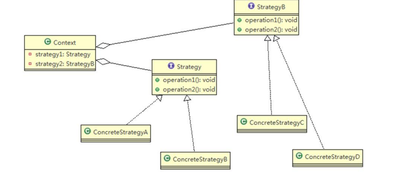
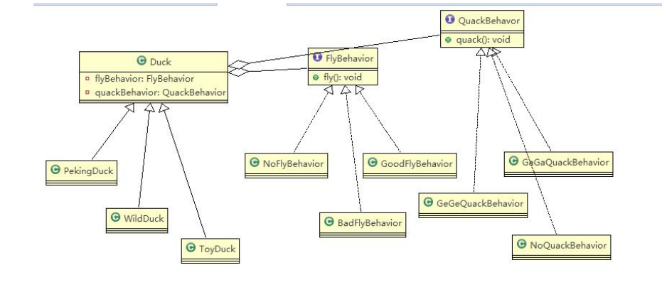

## 编写鸭子项目，具体要求如下:
1) 有各种鸭子(比如 野鸭、北京鸭、水鸭等， 鸭子有各种行为，比如 叫、飞行等)
2) 显示鸭子的信息


## 传统方案解决鸭子问题的分析和代码实现


````java
package com.atguigu.strategy;

public class Client {

	public static void main(String[] args) {
		// TODO Auto-generated method stub
		//测试
	}

}

````

````java
package com.atguigu.strategy;

public abstract class Duck {

	public Duck() {
	
	}

	public abstract void display();//显示鸭子信息
	
	public void quack() {
		System.out.println("鸭子嘎嘎叫~~");
	}
	
	public void swim() {
		System.out.println("鸭子会游泳~~");
	}
	
	public void fly() {
		System.out.println("鸭子会飞翔~~~");
	}
	
}

````

````java
package com.atguigu.strategy;

public class PekingDuck extends Duck {

	@Override
	public void display() {
		// TODO Auto-generated method stub
		System.out.println("~~北京鸭~~~");
	}
	
	//因为北京鸭不能飞翔，因此需要重写fly
	@Override
	public void fly() {
		// TODO Auto-generated method stub
		System.out.println("北京鸭不能飞翔");
	}

}

````

````java
package com.atguigu.strategy;

public class ToyDuck extends Duck{

	@Override
	public void display() {
		// TODO Auto-generated method stub
		System.out.println("玩具鸭");
	}

	//需要重写父类的所有方法
	
	public void quack() {
		System.out.println("玩具鸭不能叫~~");
	}
	
	public void swim() {
		System.out.println("玩具鸭不会游泳~~");
	}
	
	public void fly() {
		System.out.println("玩具鸭不会飞翔~~~");
	}
}

````

````java
package com.atguigu.strategy;

public class WildDuck extends Duck {

	@Override
	public void display() {
		// TODO Auto-generated method stub
		System.out.println(" 这是野鸭 ");
	}

}

````
## 传统的方式实现的问题分析和解决方案
1) 其它鸭子，都继承了 Duck 类，所以 fly 让所有子类都会飞了，这是不正确的
2) 上面说的 1 的问题，其实是继承带来的问题：对类的局部改动，尤其超类的局部改动，会影响其他部分。会有
溢出效应
3) 为了改进 1 问题，我们可以通过覆盖 fly 方法来解决 => 覆盖解决
4) 问题又来了，如果我们有一个玩具鸭子 ToyDuck, 这样就需要 ToyDuck 去覆盖 Duck 的所有实现的方法 => 解决思路 -》 策略模式 (strategy pattern)


## 策略模式基本介绍
1) 策略模式（Strategy Pattern）中，定义算法族（策略组），分别封装起来，让他们之间可以互相替换，此模式让算法的变化独立于使用算法的客户
2) 这算法体现了几个设计原则，第一、把变化的代码从不变的代码中分离出来；第二、针对接口编程而不是具体类（定义了策略接口）；第三、多用组合/聚合，少用继承（客户通过组合方式使用策略）。

   

## 策略模式解决鸭子问题
1) 应用实例要求
编写程序完成前面的鸭子项目，要求使用策略模式
2) 思路分析(类图)
策略模式：分别封装行为接口，实现算法族，超类里放行为接口对象，在子类里具体设定行为对象。原则就是：分离变化部分，封装接口，基于接口编程各种功能。此模式让行为的变化独立于算法的使用者

   

## 代码实现

````java
package com.atguigu.strategy.improve;

public class BadFlyBehavior implements FlyBehavior {

	@Override
	public void fly() {
		// TODO Auto-generated method stub
		System.out.println(" 飞翔技术一般 ");
	}

}

````

````java
package com.atguigu.strategy.improve;

public class Client {

	public static void main(String[] args) {
		// TODO Auto-generated method stub
		WildDuck wildDuck = new WildDuck();
		wildDuck.fly();//
		
		ToyDuck toyDuck = new ToyDuck();
		toyDuck.fly();
		
		PekingDuck pekingDuck = new PekingDuck();
		pekingDuck.fly();
		
		//动态改变某个对象的行为, 北京鸭 不能飞
		pekingDuck.setFlyBehavior(new NoFlyBehavior());
		System.out.println("北京鸭的实际飞翔能力");
		pekingDuck.fly();
	}

}

````

````java
package com.atguigu.strategy.improve;

public abstract class Duck {

	//属性, 策略接口
	FlyBehavior flyBehavior;
	//其它属性<->策略接口
	QuackBehavior quackBehavior;
	
	public Duck() {
	
	}

	public abstract void display();//显示鸭子信息
	
	public void quack() {
		System.out.println("鸭子嘎嘎叫~~");
	}
	
	public void swim() {
		System.out.println("鸭子会游泳~~");
	}
	
	public void fly() {
		
		//改进
		if(flyBehavior != null) {
			flyBehavior.fly();
		}
	}

	public void setFlyBehavior(FlyBehavior flyBehavior) {
		this.flyBehavior = flyBehavior;
	}
	
	
	public void setQuackBehavior(QuackBehavior quackBehavior) {
		this.quackBehavior = quackBehavior;
	}
	
	
	
}

````

````java
package com.atguigu.strategy.improve;

public interface FlyBehavior {
	
	void fly(); // 子类具体实现
}

````

````java
package com.atguigu.strategy.improve;

public class GoodFlyBehavior implements FlyBehavior {

	@Override
	public void fly() {
		// TODO Auto-generated method stub
		System.out.println(" 飞翔技术高超 ~~~");
	}

}

````

````java
package com.atguigu.strategy.improve;

public class NoFlyBehavior implements FlyBehavior{

	@Override
	public void fly() {
		// TODO Auto-generated method stub
		System.out.println(" 不会飞翔  ");
	}

}

````
````java
package com.atguigu.strategy.improve;

public class PekingDuck extends Duck {

	
	//假如北京鸭可以飞翔，但是飞翔技术一般
	public PekingDuck() {
		// TODO Auto-generated constructor stub
		flyBehavior = new BadFlyBehavior();
		
	}
	
	@Override
	public void display() {
		// TODO Auto-generated method stub
		System.out.println("~~北京鸭~~~");
	}
	
	

}

````
````java
package com.atguigu.strategy.improve;

public interface QuackBehavior {
	void quack();//子类实现
}

````
````java
package com.atguigu.strategy.improve;

public class ToyDuck extends Duck{

	
	public ToyDuck() {
		// TODO Auto-generated constructor stub
		flyBehavior = new NoFlyBehavior();
	}
	
	@Override
	public void display() {
		// TODO Auto-generated method stub
		System.out.println("玩具鸭");
	}

	//需要重写父类的所有方法
	
	public void quack() {
		System.out.println("玩具鸭不能叫~~");
	}
	
	public void swim() {
		System.out.println("玩具鸭不会游泳~~");
	}
	
	
}

````
````java
package com.atguigu.strategy.improve;

public class WildDuck extends Duck {

	
	//构造器，传入FlyBehavor 的对象
	public  WildDuck() {
		// TODO Auto-generated constructor stub
		flyBehavior = new GoodFlyBehavior();
	}
	
	
	@Override
	public void display() {
		// TODO Auto-generated method stub
		System.out.println(" 这是野鸭 ");
	}

}

````