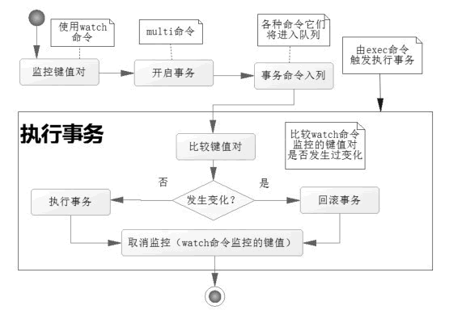

# 什么是Redis事务
Redis 事务的本质是一组命令的集合。事务支持一次执行多个命令，一个事务中所有命令都会被序列化。在事务执行过程，会按照顺序串行化执行队列中的命令，其他客户端提交的命令请求不会插入到事务执行命令序列中。 总结说：redis事务就是一次性、顺序性、排他性的执行一个队列中的一系列命令。

# Redis事务相关命令和使用
* MULTI ：开启事务，redis会将后续的命令逐个放入队列中，然后使用EXEC命令来原子化执行这个命令系列。 
* EXEC：执行事务中的所有操作命令。 
* DISCARD：取消事务，放弃执行事务块中的所有命令。 
* WATCH：监视一个或多个key,如果事务在执行前，这个key(或多个key)被其他命令修改，则事务被中断，不会执行事务中的任何命令。 
* UNWATCH：取消WATCH对所有key的监视。

# 标准的事务执行

````
127.0.0.1:6379> set k1 v1
OK
127.0.0.1:6379> set k2 v2
OK
127.0.0.1:6379> MULTI
OK
127.0.0.1:6379> set k1 11
QUEUED
127.0.0.1:6379> set k2 22
QUEUED
127.0.0.1:6379> EXEC
1) OK
2) OK
127.0.0.1:6379> get k1
"11"
127.0.0.1:6379> get k2
"22"
127.0.0.1:6379>
````

# 事务取消

````
127.0.0.1:6379> MULTI
OK
127.0.0.1:6379> set k1 33
QUEUED
127.0.0.1:6379> set k2 34
QUEUED
127.0.0.1:6379> DISCARD
OK
````

# 事务出现错误的处理
* 语法错误（编译器错误）

在开启事务后，修改k1值为11，k2值为22，但k2语法错误，最终导致事务提交失败，k1、k2保留原值。
````
127.0.0.1:6379> set k1 v1
OK
127.0.0.1:6379> set k2 v2
OK
127.0.0.1:6379> MULTI
OK
127.0.0.1:6379> set k1 11
QUEUED
127.0.0.1:6379> sets k2 22
(error) ERR unknown command `sets`, with args beginning with: `k2`, `22`, 
127.0.0.1:6379> exec
(error) EXECABORT Transaction discarded because of previous errors.
127.0.0.1:6379> get k1
"v1"
127.0.0.1:6379> get k2
"v2"
127.0.0.1:6379>
````
* Redis类型错误（运行时错误）

在开启事务后，修改k1值为11，k2值为22，但将k2的类型作为List，在运行时检测类型错误，最终导致事务提交失败，此时事务并没有回滚，而是跳过错误命令继续执行， 结果k1值改变、k2保留原值

````java
127.0.0.1:6379> set k1 v1
OK
127.0.0.1:6379> set k1 v2
OK
127.0.0.1:6379> MULTI
OK
127.0.0.1:6379> set k1 11
QUEUED
127.0.0.1:6379> lpush k2 22
QUEUED
127.0.0.1:6379> EXEC
1) OK
2) (error) WRONGTYPE Operation against a key holding the wrong kind of value
127.0.0.1:6379> get k1
"11"
127.0.0.1:6379> get k2
"v2"
127.0.0.1:6379>

````

# CAS操作实现乐观锁
WATCH 命令可以为 Redis 事务提供 check-and-set （CAS）行为。

被 WATCH 的键会被监视，并会发觉这些键是否被改动过了。 如果有至少一个被监视的键在 EXEC 执行之前被修改了， 那么整个事务都会被取消， EXEC 返回nil-reply来表示事务已经失败。

举个例子， 假设我们需要原子性地为某个值进行增 1 操作（假设 INCR 不存在）
 ````
val = GET mykey
val = val + 1
SET mykey $val
````
上面的这个实现在只有一个客户端的时候可以执行得很好。 但是， 当多个客户端同时对同一个键进行这样的操作时， 就会产生竞争条件。举个例子， 如果客户端 A 和 B 都读取了键原来的值， 比如 10 ， 那么两个客户端都会将键的值设为 11 ， 但正确的结果应该是 12 才对。 有了 WATCH ，我们就可以轻松地解决这类问题了：
````
WATCH mykey
val = GET mykey
val = val + 1
MULTI
SET mykey $val
EXEC
````
## watch是如何监视实现的呢？ 

Redis使用WATCH命令来决定事务是继续执行还是回滚，那就需要在MULTI之前使用WATCH来监控某些键值对，然后使用MULTI命令来开启事务，执行对数据结构操作的各种命令，此时这些命令入队列。

 当使用EXEC执行事务时，首先会比对WATCH所监控的键值对，如果没发生改变，它会执行事务队列中的命令，提交事务；如果发生变化，将不会执行事务中的任何命令，同时事务回滚。当然无论是否回滚，Redis都会取消执行事务前的WATCH命令。

 