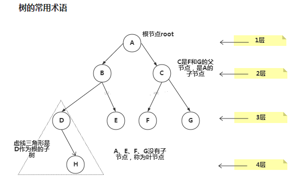
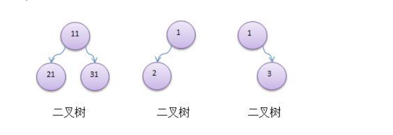

## 树结构基础概念
1) 数组存储方式的分析优点：通过下标方式访问元素，速度快。对于有序数组，还可使用二分查找提高检索速度。缺点：如果要检索具体某个值，或者插入值(按一定顺序)会整体移动，效率较低 [示意图]
2) 链式存储方式的分析优点：在一定程度上对数组存储方式有优化(比如：插入一个数值节点，只需要将插入节点，链接到链表中即可， 删除效率也很好)。缺点：在进行检索时，效率仍然较低，比如(检索某个值，需要从头节点开始遍历) 
3) 树存储方式的分析能提高数据存储，读取的效率,  比如利用 二叉排序树(Binary Sort Tree)，既可以保证数据的检索速度，同时也可以保证数据的插入，删除，修改的速度。【示意图,后面详讲】案例: [7, 3, 10, 1, 5, 9, 12]

 

## 二叉树的概念
1) 树有很多种，每个节点最多只能有两个子节点的一种形式称为二叉树。
2) 二叉树的子节点分为左节点和右节点。

    

3) 如果该二叉树的所有叶子节点都在最后一层，并且结点总数= 2^n -1 , n 为层数，则我们称为满二叉树

    

4) 如果该二叉树的所有叶子节点都在最后一层或者倒数第二层，而且最后一层的叶子节点在左边连续，倒数第二 层的叶子节点在右边连续，我们称为完全二叉树

    

## 二叉树遍历(前序,中序,后序)

1) 前序遍历: 先输出父节点，再遍历左子树和右子树 
2) 中序遍历: 先遍历左子树，再输出父节点，再遍历右子树
3) 后序遍历: 先遍历左子树，再遍历右子树，最后输出父节点

### 代码示例
````java
public class BinaryTreeDemo {

    public static void main(String[] args) {
        //先需要创建一颗二叉树
        BinaryTree binaryTree = new BinaryTree();
        //创建需要的结点
        HeroNode root = new HeroNode(1, "宋江");
        HeroNode node2 = new HeroNode(2, "吴用");
        HeroNode node3 = new HeroNode(3, "卢俊义");
        HeroNode node4 = new HeroNode(4, "林冲");
        HeroNode node5 = new HeroNode(5, "关胜");

        //说明，我们先手动创建该二叉树，后面我们学习递归的方式创建二叉树
        root.setLeft(node2);
        root.setRight(node3);
        node3.setRight(node4);
        node3.setLeft(node5);
        binaryTree.setRoot(root);

        System.out.println("前序遍历"); // 1,2,3,5,4
		binaryTree.preOrder();

        //测试
		System.out.println("中序遍历");
		binaryTree.infixOrder(); // 2,1,5,3,4

		System.out.println("后序遍历");
		binaryTree.postOrder(); // 2,5,4,3,1
    }

}

class BinaryTree{
    private HeroNode root;

    public void setRoot(HeroNode root) {
        this.root = root;
    }

    //前序遍历
    public void preOrder() {
        if(this.root != null) {
            this.root.preOrder();
        }else {
            System.out.println("二叉树为空，无法遍历");
        }
    }

    //中序遍历
    public void infixOrder() {
        if(this.root != null) {
            this.root.infixOrder();
        }else {
            System.out.println("二叉树为空，无法遍历");
        }
    }
    //后序遍历
    public void postOrder() {
        if(this.root != null) {
            this.root.postOrder();
        }else {
            System.out.println("二叉树为空，无法遍历");
        }
    }

}

class HeroNode {
    private int no;
    private String name;
    private HeroNode left;
    private HeroNode right;


    public void preOrder() {
        System.out.println(this);

        if (this.left != null){
            this.left.preOrder();
        }

        if (this.right != null){
            this.right.preOrder();
        }
    }

    public void infixOrder() {
        if (this.left != null){
            this.left.infixOrder();
        }
        System.out.println(this);
        if (this.right != null){
            this.right.infixOrder();
        }
    }

    public void postOrder() {
        if (this.left != null){
            this.left.postOrder();
        }
        if (this.right != null){
            this.right.postOrder();
        }
        System.out.println(this);

    }


    HeroNode(int no,String name){
        this.no= no;
        this.name=name;
    }

    public int getNo() {
        return no;
    }

    public void setNo(int no) {
        this.no = no;
    }

    public String getName() {
        return name;
    }

    public void setName(String name) {
        this.name = name;
    }

    public HeroNode getLeft() {
        return left;
    }

    public void setLeft(HeroNode left) {
        this.left = left;
    }

    public HeroNode getRight() {
        return right;
    }

    public void setRight(HeroNode right) {
        this.right = right;
    }

    @Override
    public String toString() {
        return "HeroNode{" +
                "no=" + no +
                ", name='" + name + '\'' +
                ", left=" + left +
                ", right=" + right +
                '}';
    }
}
````

## 二叉树-查找指定节点
    
1