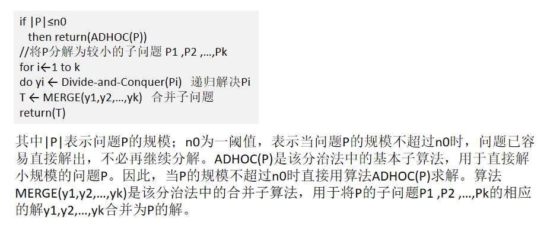

## 分治算法
1) 分治法是一种很重要的算法。字面上的解释是“分而治之”，就是把一个复杂的问题分成两个或更多的相同或相似的子问题，再把子问题分成更小的子问题……直到最后子问题可以简单的直接求解，原问题的解即子问题的解的合并。这个技巧是很多高效算法的基础，如排序算法(快速排序，归并排序)，傅立叶变换(快速傅立叶变换)……
2) 分治算法可以求解的一些经典问题
* 二分搜索
* 大整数乘法
* 棋盘覆盖
* 合并排序
* 快速排序
* 线性时间选择
* 最接近点对问题
* 循环赛日程表
* 汉诺塔

## 分治算法的基本步骤
分治法在每一层递归上都有三个步骤：
1) 分解：将原问题分解为若干个规模较小，相互独立，与原问题形式相同的子问题
2) 解决：若子问题规模较小而容易被解决则直接解，否则递归地解各个子问题
3) 合并：将各个子问题的解合并为原问题的解。

## 分治(Divide-and-Conquer(P))算法设计模式如下：

  

 ## 分治算法最佳实践-汉诺塔

1) 如果是有一个盘， A->C

如果我们有 n >= 2 情况，我们总是可以看做是两个盘 1.最下边的盘 2. 上面的盘

1) 先把 最上面的盘 A->B
2) 把最下边的盘 A->C
3) 把B塔的所有盘 从 B->C  

````java
package com.atguigu.dac;

public class Hanoitower {

	public static void main(String[] args) {
		hanoiTower(10, 'A', 'B', 'C');
	}
	
	//汉诺塔的移动的方法
	//使用分治算法
	
	public static void hanoiTower(int num, char a, char b, char c) {
		//如果只有一个盘
		if(num == 1) {
			System.out.println("第1个盘从 " + a + "->" + c);
		} else {
			//如果我们有 n >= 2 情况，我们总是可以看做是两个盘 1.最下边的一个盘 2. 上面的所有盘
			//1. 先把 最上面的所有盘 A->B， 移动过程会使用到 c
			hanoiTower(num - 1, a, c, b);
			//2. 把最下边的盘 A->C
			System.out.println("第" + num + "个盘从 " + a + "->" + c);
			//3. 把B塔的所有盘 从 B->C , 移动过程使用到 a塔  
			hanoiTower(num - 1, b, a, c);
			
		}
	}

}

````