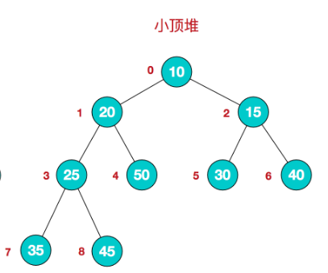

## 堆排序基本介绍

1) 堆排序是利用堆这种数据结构而设计的一种排序算法，堆排序是一种选择排序，它的最坏，最好，平均时间复杂度均为O(nlogn)，它也是不稳定排序。
2) 堆是具有以下性质的完全二叉树：每个结点的值都大于或等于其左右孩子结点的值，称为大顶堆, 注意 : 没有要求结点的左孩子的值和右孩子的值的大小关系。
3) 每个结点的值都小于或等于其左右孩子结点的值，称为小顶堆
4) 大顶堆举例说明

   

  我们对堆中的结点按层进行编号，映射到数组中就是下面这个样子: 

   
    
    大顶堆特点：arr[i] >= arr[2*i+1] && arr[i] >= arr[2*i+2]  // i 对应第几个节点，i从0开始编号

5) 小顶堆举例说明

   

   一般升序采用大顶堆，降序采用小顶堆 

## 堆排序基本思想
1) 将待排序序列构造成一个大顶堆
2) 此时，整个序列的最大值就是堆顶的根节点。
3) 将其与末尾元素进行交换，此时末尾就为最大值。
4) 然后将剩余n-1个元素重新构造成一个堆，这样会得到n个元素的次小值。如此反复执行，便能得到一个有序序列了。

## 堆排序代码实现

````java
    public static void heapSort(int arr[]) {
        int temp = 0;

        for (int i = arr.length / 2 - 1; i >=0; i--) {
            adjustHeap(arr, i, arr.length);
        }

        for (int i = arr.length - 1; i > 0; i--) {
            temp = arr[i];
            arr[i] = arr[0];
            arr[0] = temp;
            adjustHeap(arr, 0, i);
        }

    }

    public static void adjustHeap(int[] arr, int i, int length) {
        int temp = arr[i];

        for (int k = i * 2 + 1; k < length; k = k * 2 + 1) {
            if (k + 1 < length && arr[k] < arr[k + 1]) {
                k++;
            }

            if (arr[i] < arr[k]) {
                arr[i] = arr[k];
                i = k;
            } else {
                break;
            }
            arr[i] = temp;
        }

    }
````
