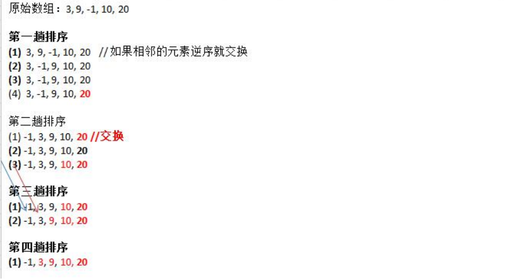
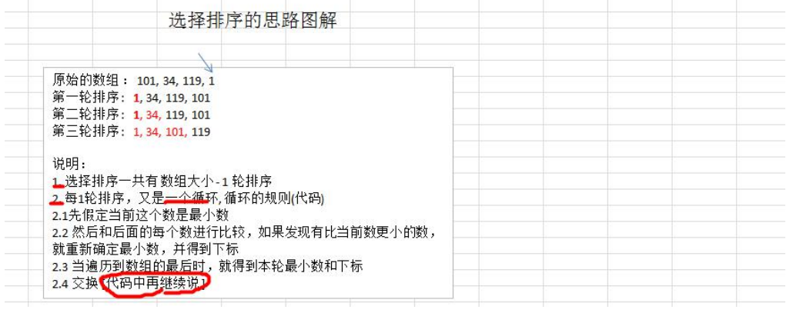
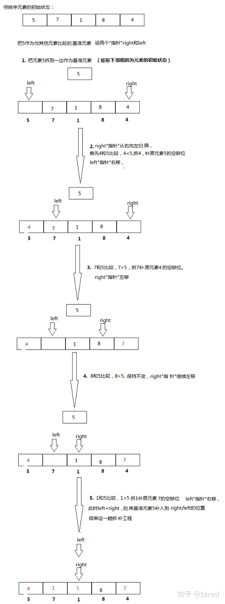
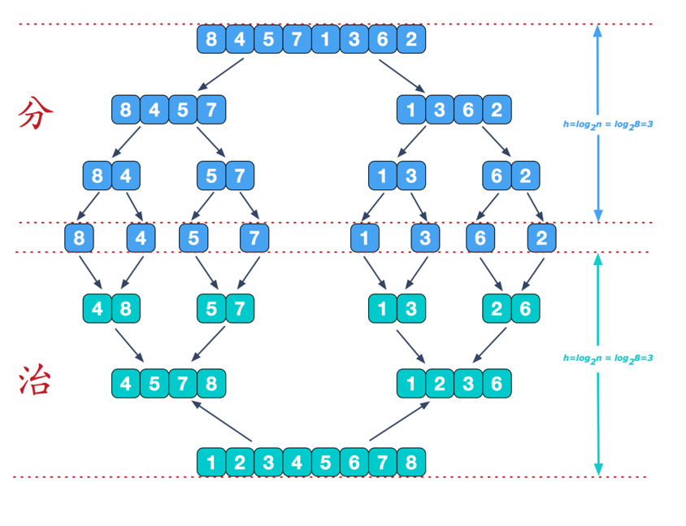

## 排序算法

排序也称排序算法(Sort Algorithm)，排序是将一组数据，依指定的顺序进行排列的过

### 排序的分类：
排序的分类：
1) 内部排序:
指将需要处理的所有数据都加载到内部存储器中进行排序。
2) 外部排序法：
数据量过大，无法全部加载到内存中，需要借助外部存储进行排序。

  

### 冒泡排序

冒泡排序（Bubble Sorting）的基本思想是：通过对待排序序列从前向后（从下标较小的元素开始）,依次比较 相邻元素的值，若发现逆序则交换，使值较大的元素逐渐从前移向后部，就象水底下的气泡一样逐渐向上冒

因为排序的过程中，各元素不断接近自己的位置，如果一趟比较下
来没有进行过交换，就说明序列有序，因此要在排序过程中设置
一个标志flag判断元素是否进行过交换。从而减少不必要的比较。

  

1) 一共进行 数组的大小-1 次 大的循环
2) 每一趟排序的次数在逐渐的减少
3) 如果我们发现在某趟排序中，没有发生一次交换， 可以提前结束冒泡排序。

#### 代码示例

````java
    public  static  void  bubbleSort(int[] arr){
        boolean flag = false;
        for (int i = 0; i < arr.length - 1;i ++){
            for (int j = 0; j < arr.length- 1 - i; j++) {
                if(arr[j] > arr[j+1]){
                    int temp = arr[j];
                    arr[j] = arr[j+1];
                    arr[j+1]= temp;
                    flag = true;
                }
            }
            if(flag){
               flag = false;
            }else {
                break;
            }
        }
    }
````

### 选择排序
选择排序（select sorting）也是一种简单的排序方法。它的基本思想是：第一次从 arr[0]~arr[n-1]中选取最小值， 与 arr[0]交换，第二次从 arr[1]~arr[n-1]中选取最小值，与 arr[1]交换，第三次从 arr[2]~arr[n-1]中选取最小值，与 arr[2] 交换，…，第 i 次从 arr[i-1]~arr[n-1]中选取最小值，与 arr[i-1]交换，…, 第 n-1 次从 arr[n-2]~arr[n-1]中选取最小值， 与 arr[n-2]交换，总共通过 n-1 次，得到一个按排序码从小到大排列的有序序列。

 

* 选择排序思路分析图

 

#### 代码示例
````java
    public static  void  selectSort(int[] arr){
        for (int i = 0; i < arr.length - 1; i++) {
            int temp = arr[i];
            int index = i;
            for (int j = i; j < arr.length - 1; j++) {
                if(temp > arr[j+1]){
                    temp = arr[j + 1];
                    index = j+1;
                }
            }
            if (index != i) {
              arr[index] = arr[i];
              arr[i] = temp;
            }
        }
    }
````
### 插入排序
插入排序（Insertion Sorting）的基本思想是：把n个待排序的元素看成为一个有序表和一个无序表，开始时有序表中只包含一个元素，无序表中包含有n-1个元素，排序过程中每次从无序表中取出第一个元素，把它的排序码依次与有序表元素的排序码进行比较，将它插入到有序表中的适当位置，使之成为新的有序表。

 

#### 代码示例

````java
    public static void insertSort(int[] arr) {
        int insertValue = 0;
        int insertIndex = 0;
        for (int i = 1; i < arr.length; i++){
            insertIndex = i - 1;
            insertValue = arr[i];
            while (insertIndex >= 0 && insertValue < arr[insertIndex]){
                arr[insertIndex + 1] = arr[insertIndex];
                insertIndex --;
            }
            if(insertIndex + 1 != i) {
                arr[insertIndex + 1] = insertValue;
            }
        }
    }
````

### 希尔排序
希尔排序是希尔（Donald Shell）于1959年提出的一种排序算法。希尔排序也是一种插入排序，它是简单插入排序经过改进之后的一个更高效的版本，也称为缩小增量排序

希尔排序是把记录按下标的一定增量分组，对每组使用直接插入排序算法排序；随着增量逐渐减少，每组包含的关键词越来越多，当增量减至1时，整个文件恰被分成一组，算法便终止

 

#### 代码示例
````java
    public static void shellSortMove(int[] arr) {

        for (int gap = arr.length / 2; gap > 0; gap /= 2) {
            for (int i = gap; i < arr.length; i++) {
                int j = i;
                int temp = arr[j];
                while (j - gap >= 0 && temp < arr[j - gap]){
                    arr[j] = arr[j-gap];
                    j -= gap;
                }
                arr[j] = temp;
            }
        }

    }
````

### 快速排序
快速排序（Quicksort）是对冒泡排序的一种改进。基本思想是：通过一趟排序将要排序的数据分割成独立的两部分，其中一部分的所有数据都比另外一部分的所有数据都要小，然后再按此方法对这两部分数据分别进行快速排序，整个排序过程可以递归进行，以此达到整个数据变成有序序列

快速排序流程：
1) 从数列中挑出一个基准值。
2) 将所有比基准值小的摆放在基准前面，所有比基准值大的摆在基准的后面(相同的数可以到任一边)；在这个分区退出之后，该基准就处于数列的中间位置。
3) 递归地把"基准值前面的子数列"和"基准值后面的子数列"进行排序。

 

#### 代码示例
````java
  public static  void quickSort(int[] arr, int left, int right){

        if(left < right){
            int key = arr[left];
            int i = left;
            int j = right;
            while (i < j) {
                while (i < j && arr[j] > key){
                    j --;
                }
                if (i < j){
                    arr[i] = arr[j];
                    i++;
                }
                while (i < j && arr[i] < key){
                    i++;
                }
                if(i < j){
                    arr[j] = arr[i];
                    j --;
                }
            }
            arr[i] = key;
            quickSort(arr,left,i-1);
            quickSort(arr,j+1,right);

        }
    }
````
## 归并排序
归并排序（MERGE-SORT）是利用归并的思想实现的排序方法，该算法采用经典的分治（divide-and-conquer）策略（分治法将问题分(divide)成一些小的问题然后递归求解，而治(conquer)的阶段则将分的阶段得到的各答案"修补"在一起，即分而治之)

 


归并排序思想示意图2-合并相邻有序子序列:

再来看看治阶段，我们需要将两个已经有序的子序列合并成一个有序序列，比如上图中的最后一次合并，要将[4,5,7,8]和[1,2,3,6]两个已经有序的子序列，合并为最终序列[1,2,3,4,5,6,7,8]，来看下实现步骤


#### 代码示例

````java

    public static void main(String[] args) {
        int[] arr = new int[80000000];
        for (int i = 0; i < 80000000; i++) {
            arr[i] = (int) (Math.random() * 800000000); //生成一个[0, 8000000) 数
        }
        long startTime = System.currentTimeMillis() / 1000;
        //测试冒泡排序
        //bubbleSort(arr);
        //selectSort(arr);
        //shellSortMove(arr);
        mergerSort(arr, 0, arr.length - 1, new int[arr.length]);
        long endTime = System.currentTimeMillis() / 1000;

        System.out.println("排序后的时间是= " + (endTime - startTime) + "秒");
        //System.out.println(Arrays.toString(arr));
    }

  
  public static void mergerSort(int[] arr, int left, int right, int[] temp) {

        if (left < right) {
            int mid = (left + right) / 2;
            mergerSort(arr, left, mid, temp);
            mergerSort(arr, mid + 1, right, temp);
            merge(arr, left, mid, right, temp);
        }

    }

    public static void merge(int[] arr, int left, int mid, int right, int[] temp) {

        int i = left;
        int j = mid + 1;
        int t = 0;
        while (i <= mid && j <= right) {
            if (arr[i] < arr[j]) {
                temp[t] = arr[i];
                i++;
                t++;
            } else {
                temp[t] = arr[j];
                j++;
                t++;
            }
        }


        while (i <= mid) {
            temp[t] = arr[i];
            i++;
            t++;
        }

        while (j <= right) {
            temp[t] = arr[j];
            j++;
            t++;
        }

        t = 0;
        int tempLeft = left;
        while(tempLeft <= right) {
            arr[tempLeft] = temp[t];
            t += 1;
            tempLeft += 1;
        }
    }
````

### 基数排序
1) 基数排序（radix sort）属于“分配式排序”（distribution sort），又称“桶子法”（bucket sort）或bin sort，顾名思义，它是通过键值的各个位的值，将要排序的元素分配至某些“桶”中，达到排序的作用
2) 基数排序法是属于稳定性的排序，基数排序法的是效率高的稳定性排序法
3) 基数排序(Radix Sort)是桶排序的扩展
4) 基数排序是1887年赫尔曼·何乐礼发明的。它是这样实现的：将整数按位数切割成不同的数字，然后按每个位数分别比较。

#### 基数排序基本思想

1) 将所有待比较数值统一为同样的数位长度，数位较短的数前面补零。然后，从最低位开始，依次进行一次排序。这样从最低位排序一直到最高位排序完成以后, 数列就变成一个有序序列。


#### 代码示例
````java
    public static void radixSort(int[] arr) {

        int max = arr[0];
        for (int i = 1; i < arr.length; i++) {
            if (arr[i] > max) {
                max = arr[i];
            }
        }

        int maxLength = String.valueOf(max).length();

        int[][] bucket = new int[10][arr.length];
        int[] bucketElementCounts = new int[10];


        for (int i = 0, n = 1; i < maxLength; i++, n *= 10) {
            for (int j = 0; j < arr.length; j++) {
                int digitOfElement = arr[j] / n % 10;
                bucket[digitOfElement][bucketElementCounts[digitOfElement]] = arr[j];
                bucketElementCounts[digitOfElement]++;
            }

            int index = 0;
            for (int k = 0; k < bucketElementCounts.length; k++) {
                if (bucketElementCounts[k] != 0) {
                    for (int l = 0; l < bucketElementCounts[k]; l++) {
                        arr[index] = bucket[k][l];
                        index++;
                    }
                }
                bucketElementCounts[k] = 0;
            }
        }

    }

````

1) 基数排序是对传统桶排序的扩展，速度很快. 
2) 基数排序是经典的空间换时间的方式，占用内存很大, 当对海量数据排序时，容易造成 OutOfMemoryError 。 
3) 基数排序时稳定的。[注:假定在待排序的记录序列中，存在多个具有相同的关键字的记录，若经过排序，这些 记录的相对次序保持不变，即在原序列中，r[i]=r[j]，且 r[i]在 r[j]之前，而在排序后的序列中，r[i]仍在 r[j]之前， 则称这种排序算法是稳定的；否则称为不稳定的]

### 常用排序算法总结和对比


### 相关术语解释：
1) 稳定：如果 a 原本在 b 前面，而 a=b，排序之后 a 仍然在 b 的前面； 
2) 不稳定：如果 a 原本在 b 的前面，而 a=b，排序之后 a 可能会出现在 b 的后面； 
3) 内排序：所有排序操作都在内存中完成； 
4) 外排序：由于数据太大，因此把数据放在磁盘中，而排序通过磁盘和内存的数据传输才能进行； 
5) 时间复杂度： 一个算法执行所耗费的时间。 
6) 空间复杂度：运行完一个程序所需内存的大小。 
7) n: 数据规模 
8) k: “桶”的个数 
9) In-place: 不占用额外内存 
10) Out-place: 占用额外内存
